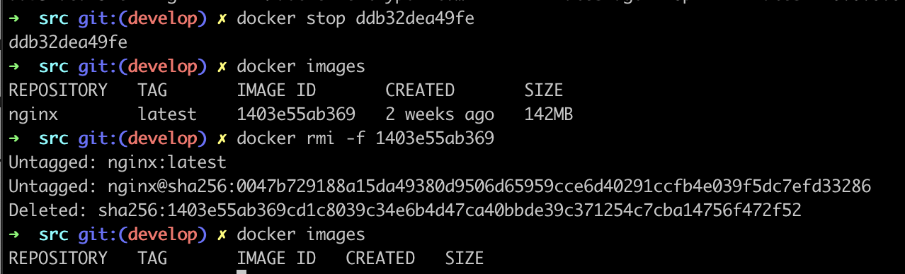

## Part 1. Готовый докер

В качестве конечной цели своей небольшой практики вы сразу выбрали написание докер образа для собственного веб сервера, а потому в начале вам нужно разобраться с уже готовым докер образом для сервера.
Ваш выбор пал на довольно простой **nginx**.

**== Задание ==**

##### Взять официальный докер образ с **nginx** и выкачать его при помощи `docker pull`

рис: вывод команды `docker pull nginx`

##### Проверить наличие докер образа через `docker images`

рис: вывод команды `docker images`

##### Запустить докер образ через `docker run -d [image_id|repository]`

рис: вывод команды `docker run -d [img_id]`

##### Проверить, что образ запустился через `docker ps`

рис: вывод команды `docker ps`

##### Посмотреть информацию о контейнере через `docker inspect [container_id|container_name]`

рис: вывод команды `docker inspect [cont_id]`

##### По выводу команды определить и поместить в отчёт размер контейнера, список замапленных портов и ip контейнера

рис: вывод команд `docker inspect [cont_id]` с фильтрами

##### Остановить докер образ через `docker stop [container_id|container_name]`
##### Проверить, что образ остановился через `docker ps`

рис: вывод команд \
`docker stop ` - остановка докер образа \
`docker ps` - проверка состояния контейнера после остановки

##### Запустить докер с замапленными портами 80 и 443 на локальную машину через команду *run*

рис: вывод команды `docker run -d -p 80:80 -p 443:443 nginx`

##### Проверить, что в браузере по адресу *localhost:80* доступна стартовая страница **nginx**

 \
рис: стартовая страница **nginx** по адресу `localhost:80`

##### Перезапустить докер контейнер через `docker restart [container_id|container_name]`
##### Проверить любым способом, что контейнер запустился

рис: вывод команд \
`docker restart ` - перезапуск докер контейнера \
`docker ps` - проверка состояния контейнера после перезапуска

- В отчёт поместить скрины:
  - вызова и вывода всех использованных в этой части задания команд;
  - стартовой страницы **nginx** по адресу *localhost:80* (адрес должен быть виден).

## Part 2. Операции с контейнером

Докер образ и контейнер готовы. Теперь можно покопаться в конфигурации **nginx** и отобразить статус страницы.

**== Задание ==**

##### Прочитать конфигурационный файл *nginx.conf* внутри докер контейнера через команду *exec*

 \
рис: вывод команды `docker exec [img_id] cat /etc/nginx/nginx.conf` - чтение файла nginx.conf

##### Создать на локальной машине файл *nginx.conf*
##### Настроить в нем по пути */status* отдачу страницы статуса сервера **nginx**

 \
рис: вывод команды `nano nginx.conf` - создание файла nginx.conf на локальной машине

##### Скопировать созданный файл *nginx.conf* внутрь докер образа через команду `docker cp`

##### Перезапустить **nginx** внутри докер образа через команду *exec*

рис: вывод команды `docker cp nginx.conf [cont_id]:/etc/nginx/`
вывод команды `docker exec [cont_id] nginx -s reload`

##### Проверить, что по адресу *localhost:80/status* отдается страничка со статусом сервера **nginx**

 \
рис: страница статуса **nginx** по адресу `localhost:80/status`

##### Экспортировать контейнер в файл *container.tar* через команду *export*

 \
рис: вывод команды `docker export [cont_id] > container.tar`

##### Остановить контейнер

##### Удалить образ через `docker rmi [image_id|repository]`, не удаляя перед этим контейнеры

 \
рис: вывод команды `docker stop [cont_id]`
вывод команды `docker rmi -f [img_id]`

##### Удалить остановленный контейнер

 \
рис: вывод команды `docker rm [cont_id]`

##### Импортировать контейнер обратно через команду *import*

 \
 \
рис: вывод команды `docker import - mynginx < container.tar` \
`docker import -c "CMD [\"nginx\", \"-g\", \"daemon off;\"]" container.tar my_nginx` - другой вариант команды

##### Запустить импортированный контейнер

 \
рис: вывод команды `docker run -d -it -p 80:80 mynginx /bin/bash`

##### Проверить, что по адресу *localhost:80/status* отдается страничка со статусом сервера **nginx**

 \
рис: страница статуса nginx по адресу localhost:80/status

- В отчёт поместить скрины:
  - вызова и вывода всех использованных в этой части задания команд;
  - содержимое созданного файла *nginx.conf*;
  - страницы со статусом сервера **nginx** по адресу *localhost:80/status*.

